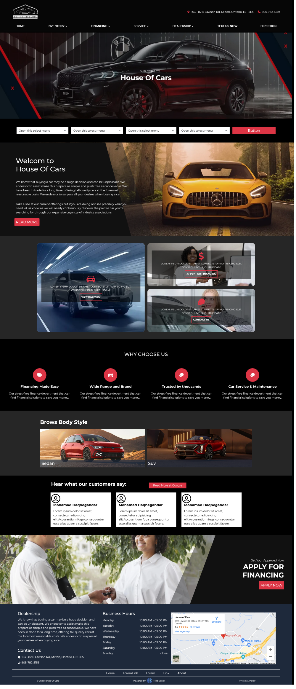

# Starline Clone - Nextjs v13.4

This is a practical **[Starline](https://hzd-on-houseofcars.azurewebsites.net/) Clone** using [Next.js](https://nextjs.org/) latest features bootstrapped with [`create-next-app`](https://github.com/vercel/next.js/tree/canary/packages/create-next-app).

Explore the [demo](https://maxjn-starline-clone.vercel.app/) and the [original](https://hzd-on-houseofcars.azurewebsites.net/) website for better understanding'.

## Technologies

- TSX, Bootstrap,
- TypeScript
- **Nextjs v13.4**
- **Main Packages:** bootstrap, sass
- **Secondary Packages:** react-icons, swiper
- **Routing:** useing page directory

## Features

- Header
- Nav Menu
- Hero Section Slider
- Advanced Search
- About Us
- Articles
- Why Choose Us
- BodyStyle
- Testimonials Slider
- CTA Section
- Footer
- Fixed Chat Button

## Installation

###### Add Environment Variables

Starting a development instance of the app

###### shell command

```shell
npm install

npm run dev
```

## Screenshots


